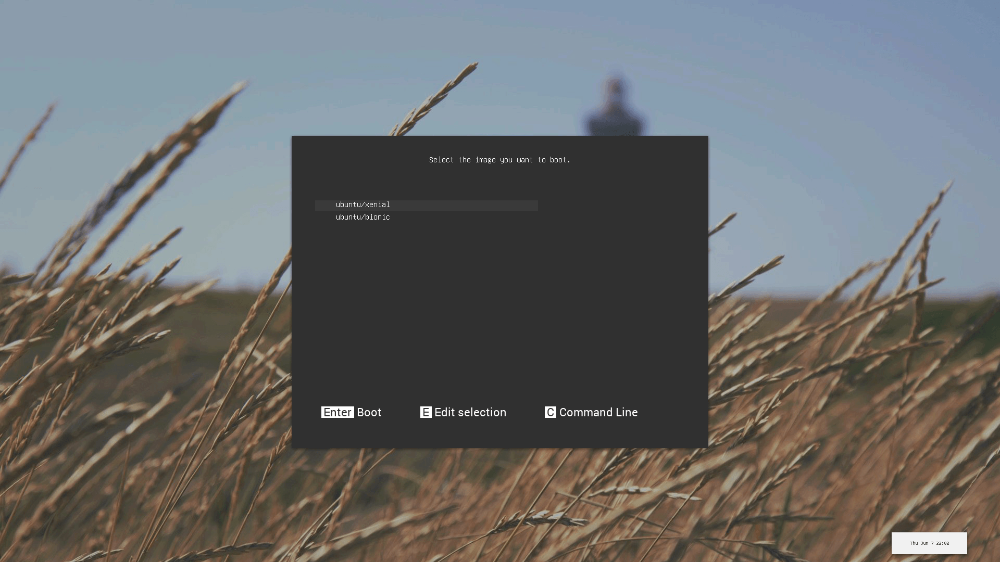

`znx` allows the user to perform the following:

- Make a parallel installation of bootable ISO images (a Linux-based distribution is expected).
- Upgrade the systems in an atomic way.
- Update the images based on differential content.

